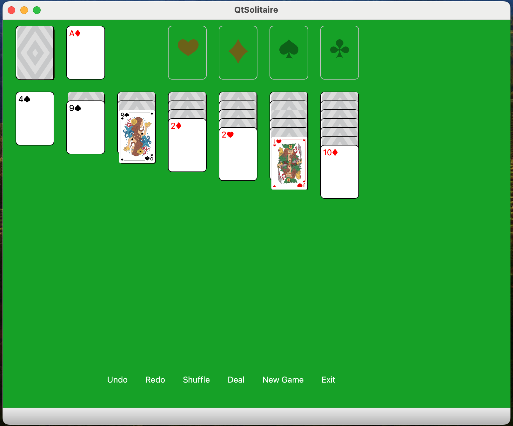
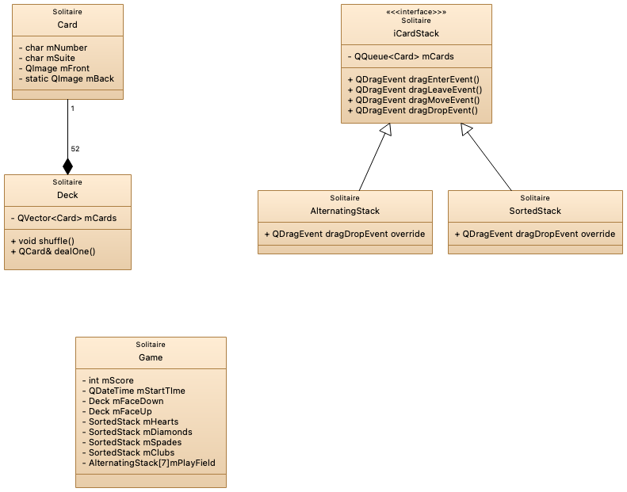

# Klondike Qt Solitaire 

This is an implementation of Klondike Solitaire using the Qt GraphicsView Framework 

All code was written by me.  I set a goal to code this project without AI input, which I have done.  Probably the last such project I will ever do.

# Goals

 * Demonstrate familiarity with Qt framework including the [Graphics View Framework](https://doc.qt.io/qt-6/graphicsview.html), 
 [Undo Framework](https://doc.qt.io/qt-6/qtwidgets-tools-undoframework-example.html),  and many other Qt classes. 
 * Demonstrate familiarity modern C++ idoms, including range-based for loops, Containers and algorithms
 * Provide gamification to *reduce* the users use of the game. 
 * Demonstrate use of CMake with Qt.

# Specifications and Design

* Specifications for the game are found at  [SolitaireSpecification.md](./Documentation/SolitaireSpecification.md) 

* An initial class diagram was done before implementation begun.
  This class. diagram was done in the QtCreator Model Editor, and the diagram source is found at [solitaireclassdiagram.qmodel](./Documentation/solitaireclassdiagram.qmodel). 
  
  

**Additional Documentation**

* A [Survey of Other Implementations](./Documentation/SurveyOfOtherImplementations.txt) was conducted after initial development was complete. 

# Developer Notes

## OSX Platform updates cause file not found errors 
After a new version of OSX is installed, the XCode SDK may be updated, resulting in file not found errors
in the SDK when attempting to build.  These can be resolved as follows
 
  1. Build -> Clear CMake Configuration
  2. Build -> Run CMake
  3. Rebuild project

## CMAKE Limitations in Qt 
* Because this is a CMAKE project, some Qt Creator features, such as "Add Existing file" are not available.  You must edit the CMakeLists.txt file to add folders and files 
* I keep a record of work done each day, which includes accomplishments, research notes, and testing notes.  The developers log is found at [Documentation/Devlog.md](./Documentation/Devlog.md)
* [TODO List](./TODO.md) - Is it ever done? 

# Attributions 

* Card Art for face cards was purchased from [VectorStock-Fantasy Deck](    * [Fantasy Deck](https://www.vectorstock.com/royalty-free-vector/set-playing-cards-printable-poker-game-kit-vector-38016577))

# License

[License](./LICENSE) is GNU GPL v3.  Because this is an educational project, it seemed to make sense to allow free use, given that it contributes to the community. 